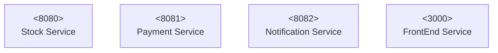

# stock-application
Sample application using react, spring boot (both rest-api and messages), kafka and firebase. Tested with cucumber and spring-test.
Docker, docker-compose, lucidchart and other technologies.

# Build state
A github action workflow will be defined to show the status of the project.


# Ideal State
Here you will have a mix of projects living under the same home (same git repo). Besides this is not the real production structure, the idea here is just to demonstrate different spring boot applications working together sending REST-API requests, Kafka Messages and interacting with a Front-end application written in React.


# Requirements 
- Java 8 installed
- Gradle (alternatively you can use the wrapper here gradlew)
- Docker 
- Docker compose 


# Ports required



# Run

For the required infrastructure, a docker-compose file has been created inside docker folder which will pull images for kafka, zookeeper and schema registry. This needs to be up and running before any of the sub-projects is started as some of them will require kafka to work.

```sh
cd docker
docker-compose up
```

Make sure the project compiles. Go into the different sub-projects and compile them and start each one of them.

```sh
./gradlew build
./gradlew bootRun
```

# Monitoring

Each microservice exposes some metrics in the following endpoint: 
http://localhost:8080/actuator 

# TODOs
- [ ] Cucumber 
- [ ] OpenAPI
- [ ] FrondEnd consuming stockApp api
- [ ] Kafka message for buying operationß